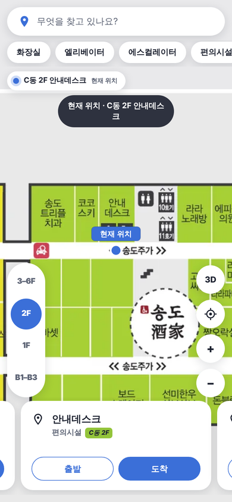
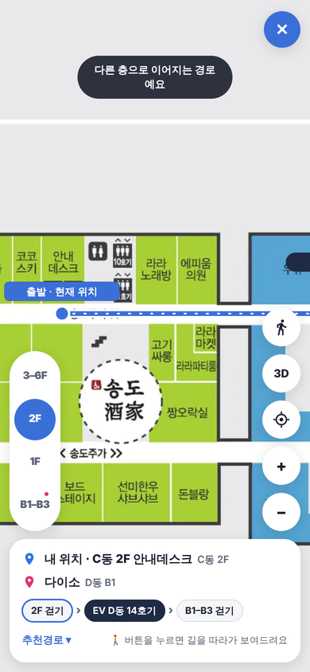
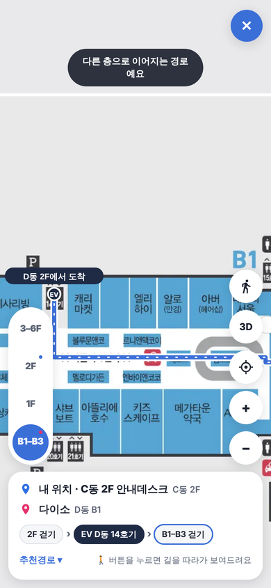

# 트리플스트리트 QR 가이드맵

송도 트리플스트리트 고객이 매장 곳곳의 QR을 휴대폰으로 스캔하면 **현재 위치**가 층별 지도에 표시되고, 가고 싶은 곳을 누르면 **층을 넘나드는 경로**를 선으로 안내하는 모바일 웹 가이드맵입니다.

**▶ 바로 열기: https://hyeonn31.github.io/triple-street-guide-map/**

| QR 스캔 첫 화면 | 2F 안내데스크에서 출발 | B1 다이소 도착 (층 이동) |
|---|---|---|
|  |  |  |

---

## 주요 기능

- **지도 전체 화면**: 지도가 화면을 꽉 채우고, 검색창·분류·층 선택·매장 카드가 지도 위에 떠 있어요.
- **QR 스캔 → 현재 위치 표시**: QR마다 고유 주소(`#1f-1` 등)가 있어서, 스캔하면 해당 층 지도가 열리고 현재 위치가 파란 점으로 표시돼요. 이 위치가 출발지로 자동 지정돼요.
- **층 선택**: 왼쪽 세로 막대로 층을 바꿔요. 2026-08-26 가이드맵 PDF에서 층별 도면을 잘라 4개로 나눴어요.

  | 탭 | 구역 | 비고 |
  |---|---|---|
  | 1F | 송도 가로수길 · 세고비아 8번가 | |
  | 2F | 하바나 2번가 · 송도주가 · 송도놀이터 | |
  | B1–B3 | 나폴리 1번가 · 메이플파크 | A·C동 B2, B동 B3, D동 B1 |
  | 3–6F | 골든파크 · 메가박스 | 5F·6F는 D동 |

- **매장 카드**: 아래 카드를 좌우로 넘기면 지도가 그 매장으로 이동해요. 카드마다 **[출발] [도착]** 버튼이 있어요. 지도에서 매장을 눌러도 카드가 열려요.
- **길 안내**: [도착]을 누르면 내 위치에서 바로 경로를 그려요. 다른 층이면 **이동수단(추천경로 / 에스컬레이터 / 엘리베이터)**을 고를 수 있어요. 출발지를 바꾸고 싶으면 [출발]을 눌러 **경로안내 화면**에서 출발·도착을 검색하거나 지도에서 골라요.
- **걸어서 따라가기 (🚶)**: 길 안내 중 버튼을 누르면 사람 아이콘이 경로를 따라 움직이고, 층이 바뀔 때 "D동 14호기 엘리베이터를 이용하여 D동 2F에서 D동 B1까지 이동합니다"처럼 알려 줘요.
- **3D 보기**: 지도를 비스듬히 기울여 볼 수 있어요. 기울인 상태에서도 매장을 눌러 고를 수 있어요.
- **검색 · 분류**: 가이드맵 층별 안내의 전체 매장 185곳(여러 층 매장 포함 205개 위치), 편의시설 34곳, 엘리베이터·에스컬레이터를 검색할 수 있어요. 검색창 아래 **화장실 / 엘리베이터 / 에스컬레이터 / 편의시설 / 푸드·카페 / 패션 / 즐길거리 / 생활** 버튼으로 바로 찾아요.
- **확대 · 이동**: 두 손가락 확대, 드래그 이동, 마우스 휠을 지원해요. 휴대폰 뒤로 가기 버튼은 열린 화면을 닫아요.
- **다크 모드**: 휴대폰 설정을 따라가요.

## QR 지점 (층별 5곳 + 6F · 총 21곳)

QR 주소 형식: `https://hyeonn31.github.io/triple-street-guide-map/#<코드>`

| 탭 | 코드 | 위치 | 상세 |
|---|---|---|---|
| 1F | `1f-1` | A동 1F 정문 | 테크노파크역 방면 입구 |
| 1F | `1f-2` | B동 1F 세고비아 8번가 | 에스컬레이터 앞 |
| 1F | `1f-3` | C동 1F 송도주가 | 송도 가로수길 쪽 입구 |
| 1F | `1f-4` | D동 1F 제우스볼링 | 세고비아 8번가 연결 통로 |
| 1F | `1f-5` | D동 1F 가로수길 | GS25 앞 광장 |
| 2F | `2f-1` | A동 2F 하바나 2번가 | 3·4호기 엘리베이터 앞 |
| 2F | `2f-2` | B동 2F 에스컬레이터 | 무신사 스토어 옆 |
| 2F | `2f-3` | C동 2F 안내데스크 | 유모차 대여 옆 |
| 2F | `2f-4` | D동 2F 송도놀이터 | 놀이터 입구 |
| 2F | `2f-5` | D동 2F 메가박스 | 매표소 앞 |
| B1–B3 | `b-1` | A동 B2 나폴리 1번가 | 한샘·모던하우스 사이 |
| B1–B3 | `b-2` | B동 B3 나폴리 1번가 | 스시로 앞 |
| B1–B3 | `b-3` | C동 B2 에스컬레이터 | 나폴리 1번가 중앙 |
| B1–B3 | `b-4` | D동 B1 메이플파크 | C동 연결부 |
| B1–B3 | `b-5` | D동 B1 다이소 | 컴포즈커피 옆 |
| 3–6F | `u-1` | A동 3-4F 골든파크 | 놉스 아래 산책로 |
| 3–6F | `u-2` | B동 3F 골든파크 | 옥상 정원 입구 |
| 3–6F | `u-3` | C동 3F 골든파크 | 이동국 축구교실 앞 |
| 3–6F | `u-4` | D동 3-4F 메가박스 | 상영관 입구 |
| 3–6F | `u-5` | D동 5F 헌혈의집 | 에스컬레이터 앞 |
| 3–6F | `u-6` | D동 6F 이동국 축구교실 | 엘리베이터 홀 |

> 처음 배포했던 `#qr1`~`#qr5` 주소는 각각 `1f-1`, `1f-5`, `2f-3`, `b-4`, `u-2`로 자동 연결돼요.

## 관리자 모드

주소 끝에 `#admin`을 붙여 열면 검색창 옆에 **[관리]** 버튼이 생기고, 고객 화면에는 없는 도구를 쓸 수 있어요.
**https://hyeonn31.github.io/triple-street-guide-map/#admin**

- **QR 스캔 테스트**: 21개 지점을 버튼으로 눌러 스캔한 것처럼 확인할 수 있어요.
- **QR 코드 인쇄용 시트**: 현재 주소(또는 입력한 주소)로 QR 21개를 만들어 줘요.
- **경로 수정하기**: 출발·도착을 골라 경로를 보면서 지도에서 바로 고치고 저장해요. 아래 [경로 고치는 법](#경로-고치는-법) 참고.

> `#admin`은 비밀번호가 아니라 숨김 처리예요. 화면이 보여도 GitHub 토큰이 없으면 아무것도 저장할 수 없어요.

## 구조

외부 서버나 빌드 과정 없이 동작해요. 화면과 매장 데이터는 `index.html`, 통로 경로망은 `routes.json`에 있어요. 층별 지도 이미지 4장은 WebP로 HTML 안에 들어 있어요(약 0.4MB).

```
triple-street-guide-map/
├── index.html      # 화면 · 지도 이미지 · QR · 매장 데이터 · 경로 계산
├── routes.json     # 통로 경로망 (관리자 화면에서 편집·저장)
├── README.md
└── docs/           # README용 스크린샷
```

좌표는 모두 **지도 이미지 가로 2000px 기준 픽셀**이에요.

| 위치 | 데이터 | 역할 |
|---|---|---|
| index.html | `PANELS` | 층 탭 4개 (이름, 부제, 이미지 크기) |
| index.html | `QRS` | QR 지점 21곳 (코드, 탭, 좌표, 이름, 설명) |
| index.html | `QR_ALIAS` | 예전 QR 주소 호환표 |
| routes.json | `nodes` | 통로 경로망의 점: `"id": ["탭", x, y]` (탭: `1F` `2F` `B` `U`) |
| routes.json | `edges` | 두 점을 잇는 통로: `["점1", "점2"]`, 추가 비용이 있으면 `["점1", "점2", 200]` |
| routes.json | `lifts` | 엘리베이터 · 에스컬레이터. 엘리베이터는 운행층끼리 바로 연결하고, 에스컬레이터는 `m` 배열 순서대로 **한 층씩만** 연결해요 (아래층 → 위층 순서) |
| routes.json | `costs` | 층간 이동 비용 (`ev` 엘리베이터, `esc` 에스컬레이터 한 층) |
| index.html | `POI` | 검색 · 목적지 239곳 `[이름, 탭, x, y, 분류]` (가이드맵 2페이지 층별 안내 기준) |

**경로 계산 방식**: 출발점과 목적지를 가장 가까운 통로 선에 붙인 다음, 다익스트라(Dijkstra) 최단 경로를 구해요. 통로 비용은 실제 길이 + 추가 비용이고, 층간 이동 비용은 기본 엘리베이터 320, 에스컬레이터 한 층당 240(픽셀 단위 가중치)이에요. 같은 에스컬레이터로 여러 층을 이어 타면 안내에서는 한 단계로 묶어 보여 줘요.

**검증**: QR 21곳 × 목적지 239곳 = 5,019개 경로가 모두 계산되는지 확인했어요 (2026-10-01). `routes.json` 분리 후에도 경로 결과가 같은지 확인했어요 (2026-10-02).

`index.html` 안의 `ROUTES_FALLBACK`은 `routes.json`을 불러오지 못할 때(파일을 직접 열었을 때 등)만 쓰는 예비본이에요.

## 경로 고치는 법

QR 주소는 경로 데이터와 상관없어서, 경로를 아무리 고쳐도 **QR을 다시 인쇄할 필요가 없어요.**

1. `#admin`으로 열고 **[관리] → 경로 수정하기**를 눌러요. 화면이 파란색 "경로 수정" 화면으로 바뀌어요.
2. **출발**(QR 지점)과 **도착**(매장)을 골라요. 지도에 경로가 빨간 선으로 그려지고, 아래에 `2F 걷기 › EV › B1 걷기`처럼 흐름이 보여요. 누르면 그 층 지도로 넘어가요.
3. 경로가 이상한 곳을 고쳐요.

| 하고 싶은 것 | 방법 |
|---|---|
| 길이 매장을 가로지른다 | **점을 끌어서** 통로로 옮겨요 |
| 실제로는 못 지나가는 길이다 | **선을 누르고 → 길 막기** |
| 지나갈 순 있지만 불편한 길이다 (계단·혼잡) | **선을 누르고 → 피하기** (주황 점선으로 표시돼요) |
| 선을 꺾어 매장을 돌아가게 하고 싶다 | **선을 누르고 → 점 넣기** → 새 점을 끌어서 옮기기 |
| 지도에 없는 지름길이 있다 | **새 길 그리기** → 지나갈 곳을 차례로 누르기 → **완료**. 다른 길에 닿으면 자동으로 이어져요 |
| 엘리베이터·에스컬레이터 타는 곳을 바꾸고 싶다 | **점을 누르고 → 층 이동 지정** |
| 방금 고친 걸 취소하고 싶다 | **↶ 되돌리기** |

   고칠 때마다 경로가 바로 다시 계산돼요. 경로가 바뀌면 **회색 점선으로 바뀌기 전 경로**가 함께 보이고, "이전보다 12% 짧아요"처럼 알려 줘요.

4. 위의 **저장**을 누르면 고친 내용 목록을 보여 주고, 확인하면 1~2분 뒤 고객 화면에 반영돼요.
   - 처음 저장할 때 한 번만 **GitHub 토큰**을 넣어요. 화면의 안내를 따라 하면 돼요: 토큰 만들기 페이지 열기 → `triple-street-guide-map` 저장소만 선택 → **Contents: Read and write** → 만든 값 붙여 넣기.
   - 저장 전에 창을 닫아도 이 기기에 임시 보관돼요. 다음에 **경로 수정하기**를 누르면 "이어서 고치기"를 물어봐요.
   - 다른 사람이 먼저 저장했으면 덮어쓰기 전에 확인을 물어요.
   - **⋯ 더보기**: 층 이동 방식(엘리베이터·에스컬레이터 비용), 토큰 없이 파일로 받기, 토큰 지우기

### QR · 매장 고치기

**경로 수정 화면에서 빈 곳을 누르고 → 좌표 복사**: `['1F', 1234, 456]` 형식의 좌표가 복사돼요. GitHub에서 `index.html` → 연필(✏️) 아이콘을 눌러 고쳐요.
- **QR 추가**: `QRS`에 `{id:'1f-6', p:'1F', x:…, y:…, name:'…', desc:'…'}` 한 줄 추가
- **매장 추가 · 변경**: `POI`에 `['매장명','2F',x,y,'food']` 수정

> 수정이 바로 안 보이면 **Ctrl + Shift + R**(강력 새로고침)이나 시크릿 창으로 확인하세요. GitHub Pages는 최대 10분 정도 캐시를 유지해요.

## 진행 현황 · 다음 할 일

- [x] 매장 목록 보강: 가이드맵 2페이지 층별 안내 전체 매장을 도면 위치에 배치 (2026-10-01)
- [x] 통로 경로망 1차 보정: 매장을 가로지르던 구간을 매장 사이 통로·건물 밖 광장 기준으로 수정 (2026-10-01)
- [x] 에스컬레이터는 한 층씩만 연결되도록 수정 (2026-10-01)
- [x] 6F QR 추가: `u-6` D동 6F 이동국 축구교실 (2026-10-01)
- [x] 고객 화면 리디자인: 지도 전체 화면, 떠 있는 검색창·분류, 세로 층 선택, 매장 카드, 경로안내 화면, 이동수단 선택, 걸어서 따라가기, 3D 보기 (2026-10-02)
- [x] 경로 수정 화면: 출발·도착 경로를 보면서 점 끌기·선 누르기·새 길 그리기로 고치고 GitHub에 바로 저장, 경로 데이터는 `routes.json`으로 분리 (2026-10-02)
- [ ] **현장 점검** (`트리플스트리트_현장점검표.xlsx`)
  - 엘리베이터 12개 그룹 운행층: 안내도에 "각 엘리베이터의 운행층이 상이하다"는 안내가 있어서, 현재는 도면 기준 추정이에요.
  - 에스컬레이터 9개 구간 운행 여부와 방향
  - 앱이 통로로 가정한 14개 구간 (예: A동 북측 → 건물 밖 광장 경유, B·D동 지하 엘리베이터 접근 통로)
  - 불탄왕뼈구이 위치: 도면에 표시가 없어서 D동 1F 가로수길에 임시로 두었어요.
- [ ] **스캔 통계**: Google Analytics 4 측정 ID를 받으면 QR별 스캔 수를 집계해요.
- [ ] **공식 도메인 연결**: 예: `map.triplestreet.co.kr` (DNS CNAME 1건 필요)

## 참고

- 원본 도면: 트리플스트리트 가이드맵 (2026-08-26판) PDF
- 지하 매장: A동 지하와 D동 지하 매장은 연결되어 있어요. 단, A·B·C·D 지하 주차장은 서로 연결되어 있지 않아요.
- 사용 라이브러리: [qrcodejs](https://github.com/davidshimjs/qrcodejs) (관리자 인쇄용 QR 생성), Google Fonts (Black Han Sans, Noto Sans KR)
- 호스팅: GitHub Pages
